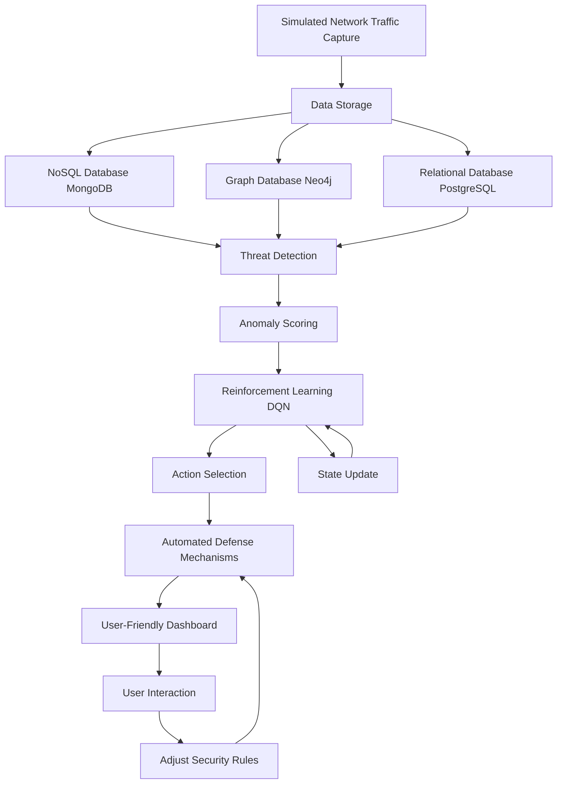

# Network Threat Detection and Defense System

## **Overview**
This project develops an intelligent system for detecting and defending against network threats using a combination of machine learning, reinforcement learning (RL), simulated malware propagation, and a multi-database architecture for efficient data storage and analysis. The system automates threat detection, network traffic analysis, and defense strategies, providing a robust security solution.

## **Key Features**

- **Network Traffic Monitoring**: Real-time network traffic analysis to detect anomalies, patterns, and potential attacks.
- **Threat Detection**: Machine learning models (Random Forest, SVM) identify malicious activities such as DDoS attacks, malware propagation, and unauthorized access.
- **Reinforcement Learning for Defense**: RL agent adapts defense strategies (e.g., blocking malicious IPs, adjusting firewall rules) based on detected threats.
- **Malware Simulation**: Simulate malware propagation across a network and develop defense mechanisms based on spread patterns.
- **User Dashboard**: Interactive dashboard to visualize network traffic, detected threats, and RL-driven actions (e.g., blocked IPs, changes in firewall settings).
- **Multi-Database Architecture**: Integration of multiple databases for optimized data storage:
  - **PostgreSQL** for statistical data.
  - **MongoDB** for storing dynamic network logs and attack details.
  - **Neo4j** for graph-based analysis of attack propagation and network relationships.

## **Technical Stack**

### **Backend**:
- Python (version 3.8+)
- Flask or Django for API and backend server management

### **Frontend**:
- React.js for UI development
- D3.js and Plotly for data visualization (graphs, charts)
  
### **Databases**:
- **PostgreSQL** (Relational Database) - for structured data like statistical data.
- **MongoDB** (NoSQL Database) - for unstructured, fast-changing data like network traffic logs, attack event data.
- **Neo4j** (Graph Database) - for network graph analysis, attack propagation, and relationship mapping.
  
### **Reinforcement Learning**:
- Stable-Baselines3 for reinforcement learning algorithms (Deep Q-Learning, etc.).

### **Graph Analysis**:
- NetworkX for network and graph-based analysis.

## **Data Flow Overview**



## Installation

### Prerequisites

- Python 3.8+
- MongoDB, Neo4j
- Node.js and npm (for frontend)

### Steps to Setup

1. Clone the repository:
    ```bash
    git clone https://github.com/yourusername/network-threat-detection.git
    cd network-threat-detection
    ```

2. Install backend dependencies:
    ```bash
    pip install -r requirements.txt
    ```

3. Install frontend dependencies:
    ```bash
    cd frontend
    npm install
    ```

4. Configure databases (MongoDB, Neo4j) as needed.

5. Run the backend:
    ```bash
    python app.py
    ```

6. Start the frontend:
    ```bash
    cd frontend
    npm start
    ```

## Evaluation

- **Detection Metrics**: Precision, Recall, F1-Score
- **Response Time**: Measure RL agent’s reaction to attacks.
- **False Positive Rate**: Track false alarms.

## Future Enhancements

- **Cloud Integration**: Improve scalability and processing power.
- **Advanced AI Models**: Explore more sophisticated anomaly detection methods.